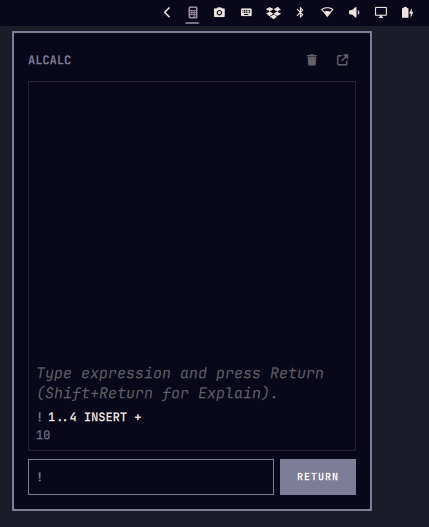

# Alcalc

<div align="center">

### Apple Calculator Language (ACL) for Linux & Omarchy

*An expressive array-oriented calculator application and CLI tool inspired by APL, classic Apple Calculator Language, and modern desktop workflows.*

[](https://www.qt.io/)
[](https://isocpp.org/)
[](LICENSE)
[](https://omarchy.org/)

<br/>



</div>

---

## 🌟 Overview

**Alcalc** is a modern standalone calculator application and CLI evaluator implementing the **Apple Calculator Language (ACL)**. It brings vectorized mathematical calculations, sequence reductions, string transformations, and one-liner algorithmic formulas to the modern Linux desktop with a beautiful Qt 6 / QML interface that automatically matches your system's light/dark theme.

---

## ✨ Features

- 📜 **Authentic Paper Tape Interface:** Minimalist, high-contrast monospace paper tape calculation environment matching classic desktop calculators.
- 🧮 **Vectorized & Array-Oriented Math:** Calculate across vectors/clumps seamlessly (e.g. `1..100 INSERT +` → `5050`, `32 50 100 212 -32*5/9` → `0 10 37.7778 100`).
- ⚡ **Sequential Left-to-Right Evaluation:** No confusing operator precedence rules (`6/3+2*5` evaluates as `20`; use parentheses `(6/3)+(2*5)` for `12`).
- 🔄 **Bottom-to-Top Paper Feed:** Calculations appear at the base of the tape and feed upward naturally as you compute.
- 🔍 **Step-by-Step Explain Mode:** Press `Shift+Return` to trace intermediate reductions step-by-step.
- 💡 **Smart Error Assistance:** Friendly diagnostics and syntax guidance for parentheses, quotes, and negative number formatting.
- ⌨️ **Keyboard-First Experience:** Autofocus single-line uppercase input bar, history navigation (`↑`/`↓`), and quick clear (`Ctrl+K` / `Ctrl+L`).
- 🧩 **Variables & Memory Inspector:** Inspect stored variables (`STORED` button) with 1-click management.
- 📖 **Interactive Tabbed Manual (`F1` / `HELP ?`):** Compact 4-tab quick reference with 1-click sample expression insertion.
- 🧩 **Omarchy Quickshell Plugin:** Seamless status bar item & popup applet for the Omarchy desktop shell.
- 🪟 **Compact Popup Mode (`alcalc --popup`):** Focused paper tape and input bar applet for quick calculations.
- 🔄 **Live State Synchronization:** Seamless real-time variable and history sharing across GUI, Quickshell, and CLI.
- 💻 **Fast CLI Tool:** Evaluate expressions directly from your shell (`alcalc "1..100 INSERT +"`, `alcalc --explain "5 TOTHE 2 + 1"`).
- 🎨 **Adaptive Theme Integration:** Dynamically adapts to dark/light mode and desktop font scaling.

---

## 🚀 Installation

Alcalc supports flexible and independent installation options:

### 1. Full Installation (App + CLI + Omarchy Plugin)
```bash
git clone https://github.com/jvlianodorneles/alcalc.git
cd alcalc
./install.sh
```

### 2. Plugin-Only Installation (No build tools or Qt6 dev headers required)
Installs **only** the native status bar widget and dropdown paper tape for Omarchy Quickshell:
```bash
./install.sh --plugin-only
```

### 3. App & CLI Only Installation
Installs the standalone Qt 6 GUI application and command-line evaluator:
```bash
./install.sh --app-only
```

### Uninstallation
```bash
./uninstall.sh                # Uninstall everything
./uninstall.sh --plugin-only  # Remove only the Omarchy plugin
./uninstall.sh --app-only     # Remove only the Desktop app & CLI
```

#### Requirements
- Qt 6 (`qt6-base`, `qt6-declarative`, `qt6-quickcontrols2`)
- C++17 compiler (`g++` or `clang++`)
- `qmake6` or `cmake`

```bash
# Using QMake
qmake6 alcalc.pro
make -j$(nproc)

# Using CMake
mkdir build && cd build
cmake ..
make -j$(nproc)
```

---

## 💻 CLI Usage

Alcalc can be used directly from the command line for fast calculations and shell scripts:

```bash
# Basic evaluation
alcalc "1..100 INSERT +"
# Output: 5050

# Sequential evaluation
alcalc "6/3+2*5"
# Output: 20

# Vector statistics
alcalc "10 20 30 MEAN"
# Output: 20

# Step-by-step explain mode
alcalc --explain "5 TOTHE 2 + 10"
# Output:
# 🔍 Step-by-Step Evaluation:
#   1. 5 TOTHE 2 = 25
#   2. 25 + 10 = 35
# Final Result: 35

# JSON formatted output
alcalc --json "PI * (5 TOTHE 2)"
```

---

## 🧩 Quickshell & Plugin Mode (Omarchy Desktop)

Alcalc integrates directly into the **Omarchy** desktop shell powered by **Quickshell**:

### 1. Quickshell Status Bar Widget
The installer copies the Alcalc Quickshell module to `~/.config/quickshell/modules/alcalc/`.

To add the Alcalc widget to your Quickshell bar (`shell.qml`):

```qml
import Quickshell
import "modules/alcalc" as Alcalc

PanelWindow {
    // ... your bar layout
    Alcalc.AlcalcBarItem {}
}
```

### 2. Standalone Compact Popup Mode (`alcalc --popup`)
You can launch the compact Paper Tape popup applet from any launcher or keybinding:

```bash
alcalc --popup
```

In Hyprland (`hyprland.conf` or `hyprland.lua`):
```ini
bind = $mainMod, C, exec, alcalc --popup
```

Variables, history, and settings are synchronized live across the Quickshell widget, GUI, and CLI.

---

## 📖 Apple Calculator Language (ACL) Crash Course

### 1. Left-to-Right Evaluation
Calculations evaluate strictly from left to right without precedence:
```text
6/3+2*5      ➔ 20    { (6/3 = 2) + 2 = 4; 4 * 5 = 20 }
(6/3)+(2*5)  ➔ 12    { Explicit grouping with parentheses }
```

### 2. Negative Numbers with `_`
In ACL, negative numbers use the underscore `_` prefix without spaces:
```text
_5 + 10      ➔ 5
_45.4 ABS    ➔ 45.4
```

### 3. Clumps, Ranges & Vector Operations
Space-separated numbers form a clump (array vector):
```text
1..5               ➔ 1 2 3 4 5
1..5 * 10          ➔ 10 20 30 40 50
(1 2 3) + (4 5 6)  ➔ 5 7 9
```

### 4. Fold / Reductions (`INSERT`)
Use `INSERT` followed by an operator to fold across a vector:
```text
1..100 INSERT +    ➔ 5050    { Sum of 1 to 100 }
1..5 INSERT *      ➔ 120     { Factorial 5! }
12 85 43 INSERT MAX➔ 85      { Maximum value }
```

### 5. Indexing & Slicing (`[ ]`)
Indexing is 1-based and supports vectors of indices:
```text
"stressed" [8..1]  ➔ desserts
(10 20 30 40)[2 4] ➔ 20 40
```

### 6. Aggregations & Math Monads
```text
10 20 30 SUM       ➔ 60
10 20 30 MEAN      ➔ 20
3 4 NORM           ➔ 5       { Euclidean magnitude sqrt(3^2 + 4^2) }
1..30 PRIMES       ➔ 2 3 5 7 11 13 17 19 23 29
17 PRIME           ➔ 1       { Primality test: 1 (true) / 0 (false) }
12 18 GCD          ➔ 6
4 6 10 LCM         ➔ 60
5 FACT             ➔ 120
64 SQRT            ➔ 8
```

### 7. Variables & Settings
```text
5 : fingers        ➔ Stored variable fingers = 5
fingers * 2        ➔ 10
2 : PLACES         ➔ Changes decimal precision to 2
0 : RADIANS        ➔ Changes angle mode to Degrees (1 = Radians)
ANS * 10           ➔ Multiplies previous answer by 10
```

---

## ⌨️ Keyboard Shortcuts

| Shortcut | Action |
|----------|--------|
| `Enter` | Evaluate expression |
| `Shift + Enter` | Evaluate with step-by-step reduction trace (Explain Mode) |
| `↑` / `↓` | Navigate calculation history in input field |
| `Tab` | Autocomplete keyword |
| `Esc` | Clear input (or close application if input is empty) |
| `Ctrl + 1` .. `Ctrl + 5` | Switch between tabs (*Calc*, *Tape*, *Formulas*, *Vars*, *Help*) |
| `Ctrl + L` | Clear input and calculation display |
| `Ctrl + Shift + C` | Copy current result to clipboard |

---

## 🧪 Testing

Run the automated engine test suite using Node.js:

```bash
node --test test/alcalc.test.js
```

---

## 📄 License

This project is licensed under the MIT License - see the [LICENSE](LICENSE) file for details.
